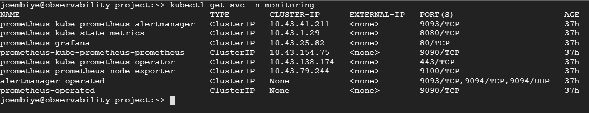
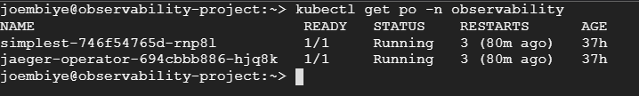
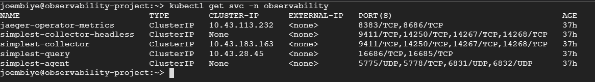

**Note:** For the screenshots, you can store all of your answer images in the `answer-img` directory.

## Verify the monitoring installation

*TODO:* run `kubectl` command to show the running pods and services for all components. Take a screenshot of the output and include it here to verify the installation

### Monitoring Pods and Services




### Observability Pod and Services




### App Pods and Services


## Setup the Jaeger and Prometheus source
*TODO:* Expose Grafana to the internet and then setup Prometheus as a data source. Provide a screenshot of the home page after logging into Grafana.


## Create a Basic Dashboard
*TODO:* Create a dashboard in Grafana that shows Prometheus as a source. Take a screenshot and include it here.


## Describe SLO/SLI
*TODO:* Describe, in your own words, what the SLIs are, based on an SLO of *monthly uptime* and *request response time*.

SLIs are the specific measurements of the uptime over a month and the time a request takes to complete. The SLO of monthly uptime and request response time is the desired achieved goal.

For example, we have the following SLO:

*The application will have a montly uptime of 99.9% and a request response time of 100ms*

After effective measurements over a month, the SLIs can be:

*Monthly uptime = 97.9%*

*Average request response time = 103ms*

## Creating SLI metrics.
*TODO:* It is important to know why we want to measure certain metrics for our customer. Describe in detail 5 metrics to measure these SLIs. 

1. ### Availability
It's a measurement of the service availability over a certain period of time. It measures the proportion of requests that resulted in a successful response.

2. ### Latency
In order to know how well our app is performing we need to measure the actual time that a request will take to complete. In this case we also measure the proportion of requests that were faster than some threshold.

3. ### Durability
For example in a storage service, we can measure the proportion of written records that can be successfully read.

4. ### Correctness
In a pipeline service, the proportion of records coming into the pipeline that resulted in the correct value coming out.

5. ### Throughput
We measure the number of requests that can be handled over a period of time.


## Create a Dashboard to measure our SLIs
*TODO:* Create a dashboard to measure the uptime of the frontend and backend services We will also want to measure to measure 40x and 50x errors. Create a dashboard that show these values over a 24 hour period and take a screenshot.


## Tracing our Flask App
*TODO:*  We will create a Jaeger span to measure the processes on the backend. Once you fill in the span, provide a screenshot of it here. Also provide a (screenshot) sample Python file containing a trace and span code used to perform Jaeger traces on the backend service.


## Jaeger in Dashboards
*TODO:* Now that the trace is running, let's add the metric to our current Grafana dashboard. Once this is completed, provide a screenshot of it here.


## Report Error
*TODO:* Using the template below, write a trouble ticket for the developers, to explain the errors that you are seeing (400, 500, latency) and to let them know the file that is causing the issue also include a screenshot of the tracer span to demonstrate how we can user a tracer to locate errors easily.

TROUBLE TICKET

Name: ```Error on backend/app/app.py```

Date: January 1, 2022

Subject: Failed to establish a new connection

Affected Area: ```File "backend/app/app.py", line 84, in not_found_error```

Severity: High

Description: ```requests.exceptions.ConnectionError: Max retries exceeded with url: /alpha. Failed to establish a new connection: [Errno 111] Connection refused```


## Creating SLIs and SLOs
*TODO:* We want to create an SLO guaranteeing that our application has a 99.95% uptime per month. Name four SLIs that you would use to measure the success of this SLO.

- Error rate: over the month, the 4xx & 5xx rates should be less than 0.5% 
- Availability: the service should be reachable 99.99% over the month
- Throughput: over the month, the 99.99% of HTTP requests should be handled
- Latency: over the month, the average time take to return a reques will be 30ms

## Building KPIs for our plan
*TODO*: Now that we have our SLIs and SLOs, create a list of 2-3 KPIs to accurately measure these metrics as well as a description of why those KPIs were chosen. We will make a dashboard for this, but first write them down here.


**Availability**

- Measure pods uptime to make sure the pods are constantly running
- Measure CPU & RAM per pod to make sure resources are not taken over by some man-in-the-middle attack

**Latency**

- Measure requests time: to make sure we don't go beyond the average accepted time
- Measure successful requests time: the successful handled requests have to be in the average accepted time to make sure our app is performing as it should

**Throughput**

- Measure rate of successful requests: successfully handled requests should hit our target SLI or go above
- Measure rate of requests per second: to make sure we hit our target goal

**Error rate**

- Measure the rate of requests with 4xx/5xx status: to make sure the error rate doesn't go beyond the accepted limit in the SLI
- Measure the rate of requests with wrong content: requests with wrong returned content should be avoided as much as possible to ensure the app's performance


## Final Dashboard
*TODO*: Create a Dashboard containing graphs that capture all the metrics of your KPIs and adequately representing your SLIs and SLOs. Include a screenshot of the dashboard here, and write a text description of what graphs are represented in the dashboard.  


1. Total requests per minute: It measures the total requests over a minute interval for each pod in the frontend and backend
2. Errors per second: It measures the number of failed http responses per second
3. CPU Usage frontend: It measures the frontend CPU usage measured over 30 seconds intervals
4. Memory usage frontend: It measures the frontend memory usage
5. CPU Usage backend: It measures the backend CPU usage measured over 30 seconds intervals
6. Memory usage backend: It measures the backend memory usage
7. Requests per second: It measures the number of successful Flask requests per second, shown per path
8. Average response time: It measures the average response time for successful requests, measured over 30s intervals
9. Request duration [s] - p50: It measures the 50th percentile of requests durations, shown per path, over the last 30 seconds
10. Requests under 250ms: It measures the percentage of successful requests finished within a quarter of a second.
